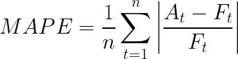
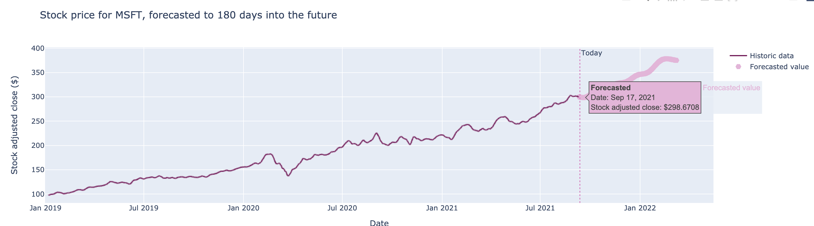
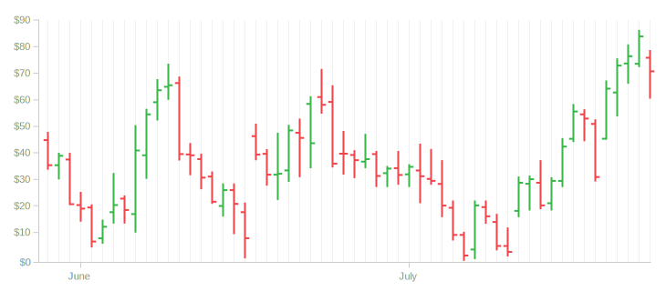

# Introduction - Stock Price Indicator
This repository contains all the code required to get a webapp running that uses facebook prophet to predict the stock price for a limited number of tickers. Current ticker supported are `AAPL`, `GOOG`, `MSFT`, `AMZN`, and `ASML`.

## Extending supported tickers
Supported tickers are read from [prophet_params.json](./params/prophet_params.json) at startup of the webapp. To extend supported trackers include them in the prophet_params.json and restart the webapp. Adding the tickers can be done by adding a valid JSON object with supported facebook prophet params, example:

```json
{"NEW_TICKER_NAME": {
   "changepoint_prior_scale": 0.45,
   "changepoint_range": 0.9,
   "seasonality_prior_scale": 10
   }
}
```

## How to run:
Requires python 3.8 or higher to run
To start the webapp on your local machine first make sure the requirements are installed by running: `pip install -r requirements.txt`

Then from the root folder of the directory run:
`python app/main.py`

The web app should now be running and available on [`http://192.168.0.182:5000/`](http://192.168.0.182:5000/).


## Project Definition
For this project, a stock price predictor using daily historic trading data to estimate the stock **adjusted close** value in the next 180 days was implemented. An interactive webapp serves as a user interface to pick a stock of interest and plot both the historic and future value on screen in a line chart.

This project can be divided in three major parts:
1. A ML model to predict the stock ticker prices
2. Collection and preprocessing of data for the model
3. A webapplication to collect user input and visualise the output of the ML model
   
For the ML part of the project [facebook prophet](https://pypi.org/project/fbprophet/) was used to create the forecasts. Stock ticker data is retrieved from [Yahoo! Finance](https://finance.yahoo.com/) to get the adjusted close values. The webapplication was implemented using a combination of [Flask](https://flask.palletsprojects.com/en/2.0.x/) for the framework and Plotly for the visualisation.


### Problem Statement
Estimate the Adjusted Close price of stock based on historical daily trading data over a certain date range. The stock ticker symbol and date range are input for the model to return estimated prices.

### Metrics
To evaluate the model performance the Mean Absolute Percentage Error (MAPE) score was used.


- *n* being the number of times the summation iteration happens
- *A<sub>t</sub>* the actual value
- *F<sub>t</sub>* the forecasted value

As the problem is a time series problem, simple cross validation is not an option as that does not take into account the temporal aspect of the data. In stead, the models are evaluated on the full data set minus the last forecast horizon of data. 


## Data Exploration & Visualisation

### Evaluating and selecting data API for historic data
For the data APIs both [Quandl](https://www.quandl.com/) and [Yahoo! Finance](https://finance.yahoo.com/) where evaluated, both through the python packages available online. Both of the APIs provide very similar data in a somewhat different structure. Yahoo!'s API was selected over Quandl with the main reason being it was easier to use and it does not require any login or API key.

### Historic data investigation
Downloading the data for one ticker symbol through the API for a period of a year returns a pandas DataFrame, making it very conventient to process it after. The data set includes the Date, the Open, High, Low, Close, Adj Close and Trading Volume. For this project we will only be using the Date and Adj Close columns.

The Date field is set as the index and inspection shows its loaded as a DatetimeIndex, conventient as this opens up out-of-the-box pandas time series functions like the `window()` and `resample()` functions

After downloading the shape of the DataFrame was checked, where the expected number of rows should be 365, 1 row for each day, this returned 252. There are some missing days of data. Closer inspectection on the data shows that its mostly weekends and some holidays that are missing, this makes sense as on theses days the stock market is closed. Using `resample()` the missing data was generated to ensure one data point per day, see [Data Preprocessing](#data-preprocessing) for more details.

There are no duplicate date values, and all columns are floats with the only exception being the Volume, which is an integer. There are no missing values for the ticker symbol (`GOOG`) inspected.


### Initial price estimates & prophet output
For the forecasting/estimating of the prices the [facebook prophet](https://pypi.org/project/fbprophet/) package was used. The package expects as input a DataFrame with a `ds` column for the date and a `y` column for the value to be estimated. As mentioned [above](#historic-data-investigation) this fits perfectly with what we want to predict, namely the adjusted closing price for a stock.

As the missing data was backfilled ([see Data Preprocessing](#data-preprocessing)]) the input data now has two columns with the Date (ds) and Adj Close (y) that we require to create an initial prediction and investigate the output.

The estimator returns a pandas DataFrame with the following columns of interest:
- ds; the date of the estimation
- yhat; estimated value
- yhat_lower & yhat_upper; lower and upper bound of the uncertainty interval

### Line graph visualisation
As this is time series data with an interest in daily values, a line chart was selected to display both the historic and estimated data. See example below.



The graph uses the 7-day moving average as the historic line and plots the daily estimated price as individual markers.


## Methodology

### Data Preprocessing
Data preprocessing is only necessary on the historic data retrieved through the [Yahoo! Finance API](https://finance.yahoo.com/). As mentioned in [above](#historic-data-investigation), the data from the API suffers from missing days of data due to the stock markets being closed. To fill in the missing data  `resample('D')` was used to generate the missing days of data in the dataframe. This creates NULL values for the days with missing data. As the markets are closed on these days we assume the Adj close prices do not change during this days. Therefore we can use the last known value to fill the missing values, for this the `.ffill()` function is used to carry forward the last known closing prices.

### Implementation
The full project is implemented as a webapp and all steps, from data collection through forecasting all the way down to the visualisation is captured through the webapp. When initially launched the webapp displays a dropdown menu where a stock ticker symbol can be selected to retrieve the historic data and estimate the future values for said ticker. The main goal was to create a no code solution for users to get an idea of how their stock of interest could perform in the future. This means all complex logic is hidden from the frontend webapp.

In the development process a series of Jupyter notebooks where used to prototype and design the data retrieval from both [Yahoo finance](working_documents/Yahoo%20finance.ipynb) and [Quandl](working_documents/Quandle%20test.ipynb) (for Quandle a wrapper was made to ensure the API would not be pushed to a public github repository). The [Yahoo notebook](working_documents/Yahoo%20finance.ipynb) was used to include tests of Plotly, facebook prophet and implementing a gridsearch to tune the parameters for prophet.

The following sections discuss in more detail which decisions where made during the implementation.

#### Picking a framework for the webapp
Initally [FastAPI](https://fastapi.tiangolo.com/) was explored as the framework to use. FastAPI offers rapid development of webapps in python and as its based on Pydantic it comes with very strong documentation possibilities through OpenAPI documentation pages. For visualisation [bokeh](https://docs.bokeh.org/en/latest/index.html) had my interest for visualising the data. The bokeh python package is a wrapper around the very powerful D3 Javascript library, opening the possibilites for some fun visualisations like a OHLC or candlestick graph. This combination proved to be quite troublesome as bokeh has quite a steep learning curve and FastAPI as a webframework is relatively young so there aren't as many online resource available compared to the popular [Flask](https://flask.palletsprojects.com/en/2.0.x/).

This quickly led to a refactor from FastAPI to Flask, but still with bokeh as the go to for visualising the graph. I was pretty set on getting a Candle stick graph up and running in the webapp and found some nice resources. After giving this a try for a while I decided to swap out bokeh for Plotly. bokeh required more javascript knowledge to get working in the webapp. This combined with the availability of online resources for Flask+Plotly supported the decision to swap out bokeh before I got in too deep.

After giving the candle stick visualisation a go with Flask+Plotly it became clear that the webrendering template for Flask was lacking support for the candle stick graph. This required an approach to pre-render the full webpage or build a full backend server setup. This was outside of the scope of the current project, as the ML part also would requier some attention soon. This led to the decision of exposing the results as a line + scatter plot instead.

#### The webapp subparts
All of the python files needed to run the webapp are in the `.app/` folder, `main.py` has the Flask framework logic and ties together how the different subparts work together. The webapp has two different "states" which are determined by how the homepage is accessed. 
- A GET request will produce a webpage with the dropdown to select a ticker symbol of choice
- A POST request with the ticker symbol data will trigger the data download, forecast and eventually will display a table with the last 7 days of data plus a line graph with the full history 7-day rolling average and points for the 180 day forecast.

The idea behind the current setup is to make it modular and work with protocols/contracts between each section. This enables the app to be extended or models to be swapped out without affecting the flow of the overall program.

All the functions have a doc string to understand in detail what they achieve. For completeness here is a summary:
- **common.py**; contains common functions needed across the application
- **data.py**; Logic to download the data from yahoo finance and preprocess, `get_clean_ticker_data()` gets the ticker data cleaned and enriched with 7-day rolling mean.
  - `get_ticker_data()`; Download the ticker data from Yahoo finance
  - `preprocess_ticker_data()`; Preprocess by filling missing days with last known values
  - `enrich_ticker_data()`; Add 7-day rolling window, seperate function to allow easy extension
- **forecast.py**; Implementation of facebook prophet. Requires a JSON file with params in `./params` to provide optimized model params.
  - `forecast_data()`; Wrapper function to execute the forecast, renames forecast column to y and use index as date.
  - `get_prophet_params()`; Gets the model params from [./params/prophet_params.json](./params/prophet_params.json)
  - `forecast_with_prophet()`; Use the prophet params and input data to generate forecast
- **graph.py**; Graphing logic for the webapp, should return a JSON representation Plotly JS understands.
  - `generate_line_graph_json()`; Creates the line graph, adds a vertical line for today and adds the estimated values as points to the line graph. Sets the HoverTemplate for the objects to be plotted.


All of the templates are in the [./app/templates](./app/templates/) folder. The app has a `layout.html`, as the name implies, it tells the app the actual layout. The `home.html` template extends the layout with more details on the actual content blocks to be populated.


#### Notebook descriptions, working documents
**[Quandle test](working_documents/Quandle%20test.ipynb)**:
In this notebook the Quandl API was used to download a set of energy data and use the Bokeh python library to plot the information on a map of the United States. The Bokeh map was based on an public Dataset and demo on the World War II THOR data set. See [bokeh plot test - WWII THOR dataset](working_documents/Bokeh%20plot%20test%20-%20WWII%20THOR%20dataset.ipynb) for the notebook loading this data and making a simple Bokeh plot. To use the Quandle notebook a `.env` file is required in the root directory of the project with a value for `QUANDLE_API_KEY=<your_key_here>`, <u>this is not provided in the repo</u>. This prompted me to pick the Yahoo API over the Quandle API.

The data in the Quandle and Bokeh use energy production data per state as the initial idea for the project was to implement a forecast around energy consumption and production in the US. The webapp then would function as a interactive dashboard to enrich some of the data with type of energy produced (green, oil, gas, coal), population size per state and some interesting supporting graphs like population growth vs increase in energy production. This migrated to the stock ticker due to the idea being a bit ambitious and the green production data I was looking for not being freely available in an online data store.

**[Yahoo finance](./working_documents/Yahoo%20finance.ipynb)**:
This notebook is the basis for the full project and as the project was moving along parts where split out and moved to their own sections. [Forecasting parameter tuning](./working_documents/Forecasting%20parameter%20tuning.ipynb) describes how facebook prophet was used in combination with a gridsearch to optimize the parameters per ticker symbol. [Create graph on forecasted data](working_documents/Create%20graph%20on%20forecasted%20data.ipynb) uses a csv data dump from the facebook prophet forecast to create a Plotly graph object with a combination of graphical objects and plotly express plotting.

**Included datasets**:
- World War II THOR dataset; See [reference documentation](https://programminghistorian.org/en/lessons/visualizing-with-bokeh#the-basics-of-bokeh) for more information on the dataset
- Shapefiles; These are shapefiles for GeoPandas to create a map of the US with states to plot data. This is not being used in the actual application but it is still here as part of the brainstorming process.
- seds_tpopp_all_states.txt; Reference from the Quandle API to get energy consumption data per state. 


### Refinement
#### Training the forecast model with prophet
To get the estimates [facebook prophet](https://pypi.org/project/fbprophet/) was used to estimate the value of stock tickers up to 180 days ahead. The data for a select set of tickers was downloaded:
- `AAPL`; Apple
- `GOOG`; Google
- `MSFT`; Microsoft
- `ADYEN.AS`; Adyen
- `AMZN`; Amazon
- `AGN.AS`; Aegon
- `AKZA.AS`; AkzoNobel 
- `ASML`; ASML
- `GLPG`; Galapagos

The selection for this tickers was made to a selection of a few large tech companies, assuming they would behave more or less the same when it comes to seasonal patterns in the data. To validate a few non-tech companies where included like Aegon, a large insurance company, Adyen (payment provider), AkzoNobel (manufactures performance coatings and paints) and Galapagos (bio-tech in medicine development). After selecting the ticker symbols the following steps where taken for each:
- Download data for ticker symbol
- Pre-process data and fit to Prophet model
- Create estimates for the ticker
- Evaluate model using a period of data that was left out, in this case 180 days

The results for the default parameters ranged from very good (~10% MAPE) to very bad (~50% MAPE). After looking at the data this is where the decision was made to train the models per ticker symbol to get the best performing model per ticker. The different ticker symbols from different industries showed that they require a wildly different set of parameters to get some performance. See [Refinement](#refinement) for model improvements.

During this initial fitting phase one of the parameters that turned out to be a strong contributer to prediction was the yearly seasonality. Yearly seasonality only works if there is atleast 1.5 years of data available. **This is why the minimum start date by default is set to 2019-01-01** for the retrieve data function.

The next step was to use a grid search to identify a general range for param optimisation. For more on this please read [Forecasting parameter tuning](forecasting_parameter_tuning.md) The Mean Abosolute Percentage Error (`MAPE`) was used to evaluate model performance during the grid search. See [Metrics](#metrics) for the formula.


### Improving the visualisation
As this is stock data an candle plot or OHLC plot would be a nice fit as it not only shows the latest value of the stock, it also gives some information on the volatility of the stock over time. The intial attempts in Bokeh where quite straight forward as there is an out-of-the-box option for such a plot. Even after swapping plotting library to Plotly the OHLC plot in a local notebook worked like a charm. Unfortunately this hit a bit of a roadblock when it comes to passing the JSON object through Flask to render the same plot in the webapp.

This made me rethink the visualisation I wanted to do and I ended up with updating the visualisation, replacing the OHLC plot with a line chart displaying the 7-day moving average. This shows the trend of a stock much more clearly as it removes some potential high outliers. After the initial visualisation was up an running, and the forecasting data was added as points the visualisation was enchanced by picking complementary colors and adding a vertical line for the date of today, the date from where the forecast starts.
</img>


## Results

### Model Evaluation and Validation


### Justification


## Conclusion

### Reflection


### Improvement

The current forecasting approach is very naïve as it only looks at historic adjusted closing rates and ignores any forms of reports, quarterly updates from the companies or prospects shared by the company. Next to this it only forecasts the expected adjusted close value for the stocks, which does not take into account scheduled divident payouts or stock splits, which influcence the adjusted closing price.

Additionally, the stock market reacts to what is going on in the world. Not only Governments introducting laws, taxes or results from elections but also wars, natural disasters and the overall confidence in the economy by "we, the people" all have their influnce on the stock markets. None of these are currently included in the model, assuming they don't operate on some interesting seasonal pattern.


<details><summary>Project rubric</summary>

#### Project definition

| Criteria | Meets specifications |
| -------- | -------------------- |
| Project Overview | Student provides a high-level overview of the project. Background information such as the problem domain, the project origin, and related data sets or input data is provided |
| Problem Statement | The problem which needs to be solved is clearly defined. A strategy for solving the problem, including discussion of the expected solution, has been made |
| Metrics | Metrics used to measure performance of a model or result are clearly defined. Metrics are justified based on the characteristics of the problem |


#### Analysis

| Criteria | Meets specifications |
| -------- | -------------------- |
| Data Exploration | Features and calculated statistics relevant to the problem have been reported and discussed related to the dataset, and a thorough description of the input space or input data has been made. Abnormalities or characteristics about the data or input that need to be addressed have been identified |
| Data Visualization | Build data visualizations to further convey the information associated with your data exploration journey. Ensure that visualizations are appropriate for the data values you are plotting. |


#### Methodology

| Criteria | Meets specifications |
| -------- | -------------------- |
| Data Preprocessing | All preprocessing steps have been clearly documented. Abnormalities or characteristics about the data or input that needed to be addressed have been corrected. If no data preprocessing is necessary, it has been clearly justified |
| Implementation | The process for which metrics, algorithms, and techniques were implemented with the given datasets or input data has been thoroughly documented. Complications that occurred during the coding process are discussed. |
| Refinement | The process of improving upon the algorithms and techniques used is clearly documented. Both the initial and final solutions are reported, along with intermediate solutions, if necessary. |


#### Results

| Criteria | Meets specifications |
| -------- | -------------------- |
| Model Evaluation and Validation | If a model is used, the following should hold: The final model’s qualities — such as parameters — are evaluated in detail. Some type of analysis is used to validate the robustness of the model’s solution. <br><br>Alternatively a student may choose to answer questions with data visualizations or other means that don't involve machine learning if a different approach best helps them address their question(s) of interest. |
| Justification | The final results are discussed in detail. Exploration as to why some techniques worked better than others, or how improvements were made are documented. |

#### Conclusion

| Criteria | Meets specifications |
| -------- | -------------------- |
| Reflection | Student adequately summarizes the end-to-end problem solution and discusses one or two particular aspects of the project they found interesting or difficult. |
| Improvement | Discussion is made as to how at least one aspect of the implementation could be improved. Potential solutions resulting from these improvements are considered and compared/contrasted to the current solution. |

#### Deliverables

| Criteria | Meets specifications |
| -------- | -------------------- |
| Write-up or Application | If the student chooses to provide a blog post the following must hold: Project report follows a well-organized structure and would be readily understood by a technical audience. Each section is written in a clear, concise and specific manner. Few grammatical and spelling mistakes are present. All resources used to complete the project are cited and referenced.<br><br>If the student chooses to submit a web-application, the following holds: There is a web application that utilizes data to inform how the web application works. The application does not need to be hosted, but directions for how to run the application on a local machine should be documented.|
| Github Repository | Student must have a Github repository of their project. The repository must have a README.md file that communicates the libraries used, the motivation for the project, the files in the repository with a small description of each, a summary of the results of the analysis, and necessary acknowledgements. If the student submits a web app rather than a blog post, then the Project Definition, Analysis, and Conclusion should be included in the README file, or in their Jupyter Notebook. Students should not use another student's code to complete the project, but they may use other references on the web including StackOverflow and Kaggle to complete the project. |
| Best Practices | Code is formatted neatly with comments and uses DRY principles. A README file is provided that provides. PEP8 is used as a guideline for best coding practices.<br><br>Best practices from software engineering and communication lessons are used to create a phenomenal end product that students can be proud to showcase! |

</details>